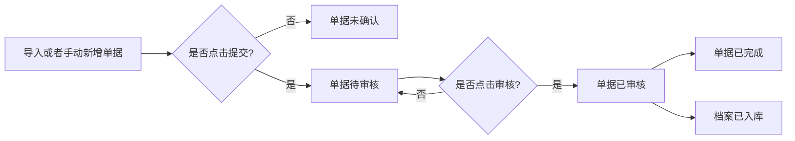
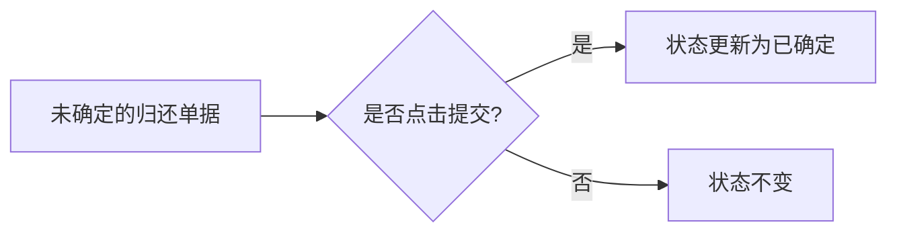
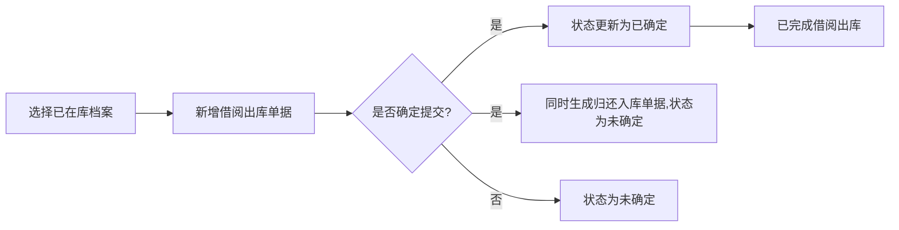

###  
民生银行档案管理系统使用手册

#### 一、登录页面：

##### 1. 网址：
> [民生银行档案管理系统](http://iot.supoin.com:8201/sign-in)

##### 2. 登录方式：
> 输入**已授权**的账号密码，点击登录。

#### 二、概览看板：

##### 1. 快速入口：
> 包含所有档案处理流程的【`快捷入口`】，以及【`配对关系`】，点击即可跳转；

##### 2. 待确认处理事项：
> 尚未经过pda手持终端或者pc端确认的单据；

##### 3. 最近完成：
> 按时间段【近7天】，【近一个月】，【近三个月】三种时间段对已完成的单据数量的统计；

#### 三、基础信息管理：

##### 1. 组织机构管理：
   - 组织管理：
     > 描述：对当前组织进行管理。
     > 功能：包括增加、修改、删除组织。

   - 页面管理：

     > 描述：调整页面的相关权限
     >
     > 功能：`是否可见`，是否有`增加`、`删除`、`修改`权限，以及控制左侧菜单栏的显示顺序。	

   - 用户管理：

     > 描述：罗列了当前登录账号所在组织，拥有的所有账号信息。
     >
     > 功能： 全局搜索、按字段搜索、`添加/修改/删除`用户信息、通过导入excel添加用户、导出用户列表。

##### 2. 档案库房：

   > 描述：维护库房信息。
   >
   > 功能：全局搜索、按字段搜索、`添加/修改/删除`库房信息、通过导入excel添加库房、导出库房列表。

##### 3. 档案状态：

   > 描述：维护档案状态信息。
   >
   > 功能：全局搜索、按字段搜索、`添加/修改/删除`库房信息、通过导入excel添加库房、导出库房列表。

##### 4. 档案类型：

   > 描述：维护档案类型信息。
   >
   > 功能：全局搜索、按字段搜索、`添加/修改/删除`档案类型信息、通过导入excel添加档案类型、导出档案类型列表。
##### 5. 员工信息：

   > 描述：维护员工信息。
   >
   > 功能：全局搜索、按字段搜索、`添加/修改/删除`员工信息、通过导入excel添加员工信息、导出员工信息列表。

##### 6. PDA信息：

   > 描述：维护PDA手持终端信息。
   >
   > 功能：全局搜索、按字段搜索、`添加/修改/删除`PDA信息、通过导入excel添加PDA信息、导出PDA信息列表。

#### 四、档案管理：

##### 1. 档案列表：

   > 描述：维护已经完成审核入库的档案信息。
   >
   > 功能：全局搜索、按字段搜索、`添加/修改`~~删除~~档案信息、通过导入excel添加档案信息、导出档案信息列表。

#### 五、入库：

##### 1. 新增入库：

> 描述：实现档案新增入库的流程。
>
> 功能：
>
> - 通过新增单据，经过一系列确认操作之后，将档案信息归档到库房中。
> - 能够全局搜索、按字段搜索所需单据。
> - 点击单据编号可查看单据包含的所有档案信息。
> - **能够删除未确定/待审核的单据**。
>
> 流程如下：

##### 2. 归还入库：

> 描述：实现档案归还入库的流程。
>
> 功能：
>
> - 通过借阅的时候新增归还单据，以及在正式归还的时候更改单据状态，实现档案的归还；
> - 能够全局搜索、按字段搜索所需单据。
> - 点击单据编号可查看单据包含的所有档案信息。
> - **能够删除未确定的单据**。
>
> 流程如下：

##### 3. 移库入库：

> 描述：实现档案移库入库的流程。
>
> 功能：
>
> - 通过移出的时候新增移入单据，以及在正式移入的时候更改单据状态，实现档案的移入；
> - 能够全局搜索、按字段搜索所需单据。
> - 点击单据编号可查看单据包含的所有档案信息。
> - **能够删除未确定的单据**。

##### 4. 销毁入库：

> 描述：实现档案销毁入库的流程。
>
> 功能：
>
> - 通过销毁出库的时候新增销毁入库单据，以及在正式销毁入库的时候更改单据状态，实现档案的移入；
> - 能够全局搜索、按字段搜索所需单据。
> - 点击单据编号可查看单据包含的所有档案信息。
> - **能够删除未确定的单据**。

> **注意**：确认销毁入库之后的档案，无法进行借阅和移出移入操作。

#### 六、出库：

##### 1. 借阅出库：

> 描述：实现档案借阅出库的流程。
>
> 功能：
>
> - 选择已经在库的档案资料，新增借阅出库的单据，初始状态为`未确定`，点击`提交`之后，状态更新为`已确定`，表示已完成借阅。
> - 能够全局搜索、按字段搜索所需单据。
> - 点击单据编号可查看单据包含的所有档案信息。
> - **能够删除未确定的单据**。
>
> 流程如下：

##### 2. 移库出库：

> 描述：实现档案借阅出库的流程。
>
> 功能：
>
> - 选择已经在库的档案资料，新增移库出库的单据，初始状态为`未确定`，点击`提交`之后，状态更新为`已确定`，表示已完成移库出库。
> - 能够全局搜索、按字段搜索所需单据。
> - 点击单据编号可查看单据包含的所有档案信息。
> - **能够删除未确定的单据**。

##### 3. 销毁出库：

>描述：实现档案借阅出库的流程。
>
>功能：
>
>- 选择已经在库的档案资料，新增销毁出库的单据，初始状态为`未确定`，点击`提交`之后，状态更新为`已确定`，表示已完成销毁出库。
>- 能够全局搜索、按字段搜索所需单据。
>- 点击单据编号可查看单据包含的所有档案信息。
>- **能够删除未确定的单据**。

#### 七、盘点管理：

##### 1. 盘点计划：

> 描述：实现盘点的流程。
>
> 功能：
>
> - 选择已经在库的档案资料，新增盘点计划的单据，点击`生成单据`之后，状态更新为`已盘点`，初始状态为`未盘点`。
> - 点开对应单据号，在弹出的界面点击`盘点完成`，即可更改盘点状态为`已盘点`。
> - **能够删除未盘点的单据**。
> - 点击单据编号可查看单据包含的所有档案信息。
>
> 流程如下：

##### 2. 盘点历史：

> 描述：管理已盘点的单据。
>
> 功能：
>
> - 能够全局搜索、按字段搜索所需单据。
>
> - 点击单据编号可查看单据包含的所有档案信息。

#### 八、系统管理：

##### 1. 页面配置：

> 描述：管理页面左侧菜单栏。
>
> 功能：
>
> - 调整菜单栏显示顺序
> - 修改菜单栏的名称

##### 2. 属性配置：

> 描述：管理各功能页面中，表格字段的名称、显示长度、描述信息等。
>
> 功能：
>
> - 修改字段顺序
> - 修改字段的名称、显示长度、描述信息。

##### 3. 个人信息：

> 描述：管理本登录账号的个人信息。
>
> 功能：
>
> - 查看个人信息：用户名，手机号码、邮箱等。

##### 4. 操作日志：

> 描述：管理页面各功能菜单的操作日志
>
> 功能：
>
> - 能够全局搜索、按字段搜索、选定时间范围查看操作日志。

